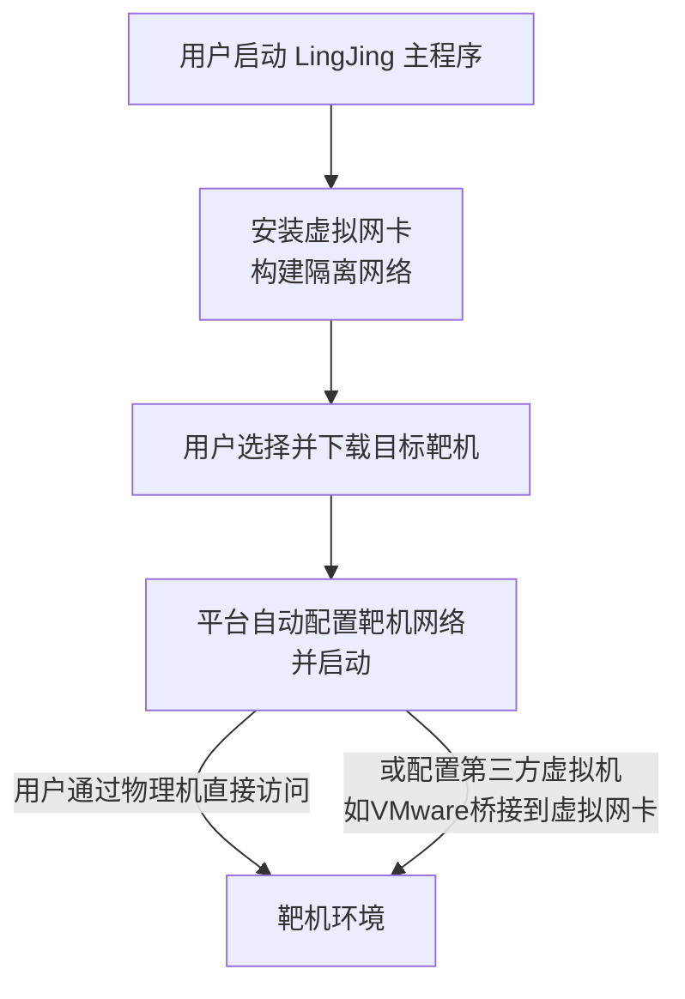

# Windows 11 上一键部署：LingJing（灵境）集成靶场环境搭建全攻略

> 对于网络安全爱好者和白帽渗透测试人员而言，一个随时可用、开箱即用的漏洞靶场环境是学习和研究的基础。然而，传统靶场搭建往往涉及复杂的虚拟机网络配置、系统安装和环境部署过程，耗时耗力。LingJing（灵境）的出现，完美地解决了这一痛点。它提供了一个高度集成的平台，让复杂的靶场环境搭建变得如同安装一个普通软件一样简单。本文将手把手教你如何在 Windows 11 上快速部署并运行你的第一个灵境靶场。

---

## 目录
- [一、免责声明：安全研究与教育的边界](#一-免责声明安全研究与教育的边界)
- [二、工具简介：什么是 LingJing（灵境）？](#二-工具简介什么是-lingjing灵境)
- [三、工作原理：它是如何实现一键部署的？](#三-工作原理它是如何实现一键部署的)
- [四、实战搭建：四步部署你的私人靶场](#四-实战搭建四步部署你的私人靶场)
  - [第一步：项目下载与解压](#第一步项目下载与解压)
  - [第二步：处理安全软件误报](#第二步处理安全软件误报)
  - [第三步：安装虚拟网卡（关键步骤）](#第三步安装虚拟网卡关键步骤)
  - [第四步：下载并启动你的第一个靶机](#第四步下载并启动你的第一个靶机)
- [五、常见问题与异常处理 (FAQ)](#五-常见问题与异常处理-faq)
  - [1. 路由正常但无法访问靶机](#1-路由正常但无法访问靶机)
  - [2. 平台重复卡在安装网卡对话框](#2-平台重复卡在安装网卡对话框)
  - [3. 报错【WGL: The driver does not appear to support OpenGL】](#3-报错wgl-the-driver-does-not-appear-to-support-opengl)
  - [4. 其他报错](#4-其他报错)
- [六、总结](#六-总结)

## 一、 免责声明：安全研究与教育的边界

在开始之前，请务必阅读并理解以下内容。​**安全技术是一把双刃剑，正确的用途至关重要。​**​

​**本平台仅供网络安全研究与教育用途，旨在提供给具备专业技能的白帽渗透测试人员进行合法的渗透测试和安全评估。非相关人员切勿随意使用或滥用。任何未经授权的网络渗透、入侵或对他人网络的破坏行为均违反法律规定，使用者应对自身行为负责。本平台开发者及分享者不对因用户滥用或非法使用平台导致的任何后果承担责任。请务必遵循当地相关法律法规。​**​

---

## 二、 工具简介：什么是 LingJing（灵境）？

- ​**是什么**​：LingJing（灵境）是一个**高度集成的渗透测试靶场环境**。它将虚拟机、虚拟网络配置等复杂步骤全部封装 behind the scenes，用户只需通过一个简洁的图形化界面，即可一键下载、安装并启动各种预配置好的漏洞靶机。
    
- ​**核心优势**​：
    
    - ​**开箱即用**​：无需手动配置虚拟网络或安装系统，极大降低了学习门槛。
        
    - ​**靶场丰富**​：平台集成了大量常见漏洞的靶场环境，适合从初级到高级的学习路径。
        
    - ​**隔离性好**​：通过虚拟网卡实现主机与靶机的网络隔离，避免误操作对真实网络造成影响。
        
    
- ​**系统支持**​：目前已为 ​**Windows AMD64**​ 进行适配，已适配 Windows 10/11 家庭版、专业版及英文版。​**Windows 7 不在支持范围内，服务器版本尚未测试。​**​
	
- **功能与结构，以及开发者后续更新方向**：
	

---

## 三、 工作原理：它是如何实现一键部署的？

为了更清晰地理解 LingJing 的便捷性，我们来了解一下其内部的工作流程：

从上图可以看出，LingJing 自动完成了最繁琐的网络配置部分，用户只需关心核心的学习和测试操作。

---

## 四、 实战搭建：四步部署你的私人靶场

### 第一步：项目下载与解压

1. ​**访问项目地址**​：项目的官方发布地址位于 GitHub。请访问 [https://github.com/414aaj/LingJing](https://github.com/414aaj/LingJing)。
    
2. ​**下载与解压**​：下载最新的发布版本（Release），通常是一个压缩包。下载完成后，将其解压到你认为合适的路径下
    ​
    ==重要提示​：​路径不可包含中文、空格、特殊字符(下划线除外)​==，例如 `D:\PenTest_Env\LingJing`是一个合格的路径。
    

### 第二步：处理安全软件误报

由于平台采用了压缩技术与必要的系统级 API 调用，部分安全软件可能会误报。这是正常现象。

- 当运行程序时，如果出现安全软件拦截提示，请选择“允许程序所有操作”或“添加信任”。
    
    
    
    
    
- 平台未植入任何后门或暗桩，可随时接受公开审计。如遇提示，请将本程序加入信任列表即可正常使用。
    

### 第三步：安装虚拟网卡（关键步骤）

虚拟网卡是 LingJing 实现网络隔离和通信的核心组件。

1. ​**以管理员身份运行**​：首次启动 `LingJing_windows_amd64.exe`时，==务必右键选择“以管理员身份运行”​==，否则即使点击确认也**可能还会导致安装不成功以及路由一直卡在显示“路由启动中”，甚至导致后面开启靶场访问时超时，需要重启路由解决**。
    
    
    
2. ​**安装网卡**​：程序启动后，会自动提示安装虚拟网卡。点击“安装”，通常几秒钟即可完成。
    
    
    
3. ​**选择访问模式**​：安装完成后会弹出对话框进行选择：
    
    - ​**仅物理机访问靶机**​：重启平台即可。
        
    - ​**需使用VMware等第三方虚拟机访问靶机**​：则必须**重启物理机**，否则第三方虚拟机无法识别并桥接到 LingJing 的虚拟网卡。
        
        
        
    

### 第四步：下载并启动你的第一个靶机

网卡安装成功后，就可以开始畅游靶场了。

1. ​**设置靶机存放路径**​：首次下载靶机时，会要求你设置一个存放路径。同样，​**路径不可出现中文、空格、特殊符号(下划线除外)​**。
	
	**注意**：
	- 下载路径：LingJing在互联网上下载的靶场压缩包临时存放的文件夹路径，下载完后会自动删除压缩包防止额外空间浪费。
		
	- 靶场存放路径：下载路径的压缩包解压缩的目的地，是存放靶场、平台打开靶场的路径。
		
	- 下载路径 和 靶场存放路径 建议分别选择 Downloads 和 targets ，选择后平台会自动添加子文件夹。
		
	
    
1. ​**下载与启动**​：在靶机市场中选择你想要的靶机环境，点击下载。下载完成后，直接点击“启动”即可。平台会自动为靶机配置好网络并开机。
	
2. ​**访问靶机**​：启动后，在平台中即可看到靶机的访问地址（IP地址）。你可以在物理机的浏览器或攻击工具中直接访问此IP。**建议访问前点击上方设置，重置路由，防止访问失败**
	
	
	
	
  
**靶场搭建完成，骚年，开启你的渗透之旅吧！**

---

## 五、 常见问题与异常处理 (FAQ)

由于 Windows 网络环境复杂，遇到问题可按以下步骤排查：

### 1. 路由正常但无法访问靶机

- ​**首要排查**​：确认主机是否使用了代理或者VPN，请暂时关闭。
    
- ​**路径检查**​：再次确认平台和靶机存放**路径不能存在中文、空格、特殊符号**。
    
- ​**防火墙排查**​：部分靶机存在防火墙，可用 `nmap`等工具扫描靶机IP，确定端口是否开放。
    
- ​**重启大法**​：按照顺序递进验证：管理员身份重启靶机 -> ==重启路由（解决90%问题）== -> 重装网卡 -> 重启平台 -> 重启电脑。
    

### 2. 平台重复卡在安装网卡对话框

部分设备可能因权限问题反复卡在“申请管理员权限运行”这一步。

- ​**手动安装**​：退出平台，找到以下路径的程序：`LingJing_windows_amd64\resources\tap\tapInstall.exe`。
    
    
    
- ​**右键“以管理员身份运行”​**​ `tapInstall.exe`完成安装。
    
- ​**验证**​：在命令行中执行 `ipconfig`，查看是否存在名为 `LingJing`或类似名称的虚拟网卡，若存在即可正常运行平台。
    
    
    

### 3. 报错【WGL: The driver does not appear to support OpenGL】

此错误通常与显卡驱动有关。

- 请更新你的显卡驱动程序到最新版本。
    
- 确保系统已安装必要的运行库（如 Visual C++ Redistributable）。
    

### 4. 其他报错

若按上文仍无法解决，可将日志文件通过 GitHub Issue 或交流群反馈给作者。日志文件位于 LingJing 程序同级目录下的 `logs`文件夹中。

---

## 六、 总结

LingJing（灵境）极大地简化了渗透测试靶场的搭建过程，让学习者能更专注于漏洞原理本身和研究利用技巧，而不必在环境配置上浪费过多时间。它的优势在于：

1. ​**极致简化**​：一键下载、一键启动，彻底告别复杂配置。
    
2. ​**生态集成**​：内置丰富的靶场环境，并支持外部靶机导入，扩展性强。
    
3. ​**安全隔离**​：通过虚拟化技术确保实验环境与真实网络隔离，操作更安心。
    

希望本篇教程能帮助你快速上手 LingJing，开启你的网络安全实战之旅。如果你在配置中遇到任何问题，欢迎在评论区留言讨论！

---
> Author: 天认u
> GitHub: [tianrenu](https://github.com/tianrenu)
> GitHub Pages: [https://tianrenu.github.io](https://tianrenu.github.io/)
> License: [CC BY-NC-SA 4.0](https://creativecommons.org/licenses/by-nc-sa/4.0/)
---
