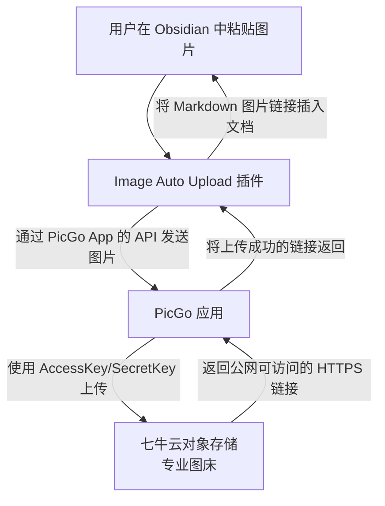

# 告别文档臃肿！零门槛搭建Obsidian+PicGo图床

> 作为初学者，相信很多人写学习笔记、文章、报告等第一想到的是WPS、Office办公软件三件套。但是我今天分享一个解决作为初学者最根本的问题：如何解决笔记、文章等需要图片而导致的存储空间翻倍、设备间同步困难，以及如何让写文章这件事本身变得轻松、高效且愉悦。一个好的工作流能让学习事半功倍。本文及以后周报文章都是以这样的组合进行创作上传

---
## 一、 痛点与解决方案：为什么需要它们？

你是否遇到过这些烦恼？
-   写了一篇图文并茂的学习笔记，用微信发给别人，却发现图片全都“消失”了。
-   笔记文档因为塞满了图片，体积巨大，几次下来就占用了几个G的空间。
-   想在手机、平板、电脑上同步查看笔记，但因为图片太多，同步起来慢如蜗牛。

**核心问题在于：传统的文档把文字和图片“捆绑”在一起。**

而今天介绍的 **Obsidian + PicGo + 七牛云** 组合拳，就是为了实现 **“文字与图片分离”**：
-   **文字** 保存在本地的 Markdown (.md) 文件里，体积小，易同步，永不丢失。
-   **图片** 上传到专业的云存储（图床），在文档中只保留一个“链接”。

当你打开文档时，软件会根据这个链接去网上加载图片。这样就完美解决了上述所有痛点！

---
## 二、 工作原理：它们是如何协同工作的？

在开始配置前，先用一张图看懂这三个工具是如何分工合作的，这能让你理解每一步操作的意义：

从上图可以看出：
-   **Obsidian** 是你的**主战场**，负责编辑和呈现最终内容。
-   **PicGo** 是核心**中转站**，负责将图片安全地送达图床，并取回链接。
-   **七牛云** 是**仓库**，负责为你安全、高速地存储和分发图片。

理解了这个流程，配置起来就会清晰很多。

---
## 三、 工具简介：

-   **Obsidian**：
    -   **是什么**：一个基于本地 Markdown 文件的**知识库管理软件**。它就像你的无限画布，所有笔记都是你自己掌握的文件。
    -   **核心优势**：**双向链接**功能可以让你像织网一样连接知识，非常适合构建个人知识体系。界面简洁，插件生态丰富。

-   **PicGo**：
    -   **是什么**：一个**专业的图片上传工具**。你只需把图片拖进去，它就自动上传到你预设的云仓库（图床），并把链接复制到你的剪贴板。
    -   **核心优势**：**跨平台**（Win/Mac/Linux），**支持多种图床**，有完备的桌面端和插件系统，是连接本地和云端的桥梁。

-   **七牛云对象存储 (Kodo)**：
    -   **是什么**：国内一家云服务商提供的**文件存储服务**。你可以把它理解为一个无限大的、速度极快的**网上硬盘**，专门用来存放图片等文件。
    -   **核心优势**：**免费额度**对个人用户非常友好（10GB免费存储空间+每月10GB免费下载流量），完全够用。速度和稳定性都很好。

---
## 四、 前置条件：关于域名的必读须知⚠️

在开始配置七牛云之前，有一个**至关重要**的事情你必须了解：

**七牛云会为每个存储空间提供一个为期30天的临时测试域名（`http://xxx.bkt.clouddn.com`）。这个域名一个月后会自动失效，导致你的所有图片链接无法访问！**

因此，如果你希望图床链接**长期稳定有效**，你有且仅有一个选择：
**使用你自己购买的、已完成备案的自定义域名（如我的 `www.tianren-lacia.top`）来替代官方提供的测试域名。**

这意味着你需要完成以下两个前置步骤：

### 前置步骤 1: 购买域名与云服务器

1.  **购买域名**：在阿里云、腾讯云等服务商处购买一个你喜欢的域名（如 `tianren-lacia.top`），价格通常每年几十元，新用户最低可达150元+/10年。
2.  **购买云服务器**：**（这是备案的强制要求）** 国内政策规定，域名备案必须有一台大陆地区的云服务器。你可以购买阿里云/腾讯云最便宜的那款“轻量应用服务器”或“ECS云服务器”，新用户优惠价通常一年几十到一百元左右，甚至阿里云可提供高校计划免费领取300元无门槛轻松拿到一年云服务器，**可仅用于备案**，备案完成后几乎可以不再使用。

### 前置步骤 2: 完成域名备案

1.  **提交备案**：在你购买服务器的服务商平台（如阿里云）找到“域名备案”入口，按照指引提交相关资料。这个过程通常需要**10-20天**的审核时间，需要一点耐心。
2.  **解析域名**：备案通过后，你需要到域名管理后台，将你的域名（例如 `www.yourname.com`）解析（CNAME记录）到你那台用于备案的服务器IP地址上，备案系统会以此进行核查。

**请注意**：以上两步（购买+备案）是为了满足国家法规要求，过程稍显繁琐，但这是一次性的、一劳永逸的投入。完成之后，你这个域名下的所有服务（无论是图床还是未来可能搭建的博客）都会非常稳定。

**给你的两个选择：**

-   **想长期稳定使用**：请务必完成上述前置步骤，然后再进行下面的七牛云配置。本文后续的教程都假设你使用自己的已备案域名。
-   **只是想先体验一下**：你可以先使用七牛云的30天测试域名快速体验整个工作流。但请务必记住，**一个月后你需要用自己的域名替换掉测试域名**，否则所有图片都会失效。

---
## 五、 实战配置：三步搭建高效工作流

### 第一步：配置你的网上仓库（七牛云）

（接下来的内容保持不变，但假设用户已经拥有了已备案的自定义域名）
1.  **注册与认证**：访问[七牛云官网](https://www.qiniu.com/)注册账号，并完成实名认证...
2.  **绑定自定义域名（关键）**：
    -   在七牛云控制台，进入“对象存储Kodo” -> "空间管理" -> “域名管理” -> "绑定域名"。
	    
	    
	    
		
    - “绑定域名”填写你**已经备案好的域名**，例如 `img.yourname.com`。**注意：如果需要放到其他网络平台的有一定要选择HTTPS⚠️**，因为现在主流网站（如GitHub）都是加密的（HTTPS）。如果一个安全页面里加载了不安全的 HTTP 图片，浏览器会出于安全考虑阻止它显示。
	    
    -   七牛云会给你一个 CNAME 记录值，你需要到你购买域名的平台（如阿里云），将 `img.yourname.com` 解析到该 CNAME 值。
	    
		
    -   等待域名解析生效（通常几秒到几分钟）。
	    
3.  **获取钥匙**：在“密钥管理”中拿到你的 `AccessKey` 和 `SecretKey`...
	
	

### 第二步：配置你的运输车（PicGo）

1.  **下载安装**：[下载 PicGo](https://github.com/Molunerfinn/PicGo/releases) 并安装，也可以尝试在自带的应用商店下载，一般有。
2.  **配置七牛云**：
    -   打开 PicGo -> “图床设置” -> “七牛云”。
    -   填上一步获取的 `AccessKey`, `SecretKey` 和 存储空间名称 、存储区域。
	    
    -   **最最关键的一步**：在“自定义域名”中，填写你**已经绑定到七牛云上的、已备案的域名**，并**务必加上 `https://` 开头**！（例如：`https://img.yourname.com`）
    -   设好后，可以拖张图片测试上传，一切正常的话，相册里会出现一条以 `https://` 开头的链接。
	    

### 第三步：打通最后一步（Obsidian 自动化）

1.  **下载安装**：[下载 obsidian](https://obsidian.md/download) 并安装，也可以尝试在自带的应用商店下载，一般有。
2.  **安装插件**：在 Obsidian 设置中，进入“社区插件”，搜索并安装 `Image Auto Upload`。
	
	
3.  **简单配置**：
    -   启用插件后，在它的设置里，上传器选择 `PicGo app`。
	    
    -   **确保 PicGo 应用正在后台运行**：一般点击PicGo运行程序后不会跳出弹窗，而是在后台运行。
	    
4.  **享受魔法**：
    -   现在，当你写笔记时，**直接截图并按 Ctrl+V 粘贴**。
    -   稍等一秒，你会发现截图变成了一个完美的图片，点击图片发现是一个URL链接！所有上传、复制、插入的流程都已自动完成。
	    

---
## 六、 总结：这套方案的优势

1.  **一劳永逸**：一次配置，终身受益。所有笔记场景通用。
2.  **轻便简洁**：笔记文件本身非常小，便于同步和管理。
	可见将图片上传至云储存，以链接形式加载图片可以节省大量空间
	
3.  **云原生**：图片由专业 CDN 分发，在任何设备上打开笔记，加载速度都很快。

这不仅仅是一个配置教程，更是一种全新的内容管理思维。希望这篇指南能帮你打开高效学习与写作的大门。如果你在配置中遇到任何问题，欢迎留言讨论！

---
> Author: 天认u
> GitHub: [tianrenu](https://github.com/tianrenu)
> GitHub Pages: [https://tianrenu.github.io](https://tianrenu.github.io)
> License: [CC BY-NC-SA 4.0](https://creativecommons.org/licenses/by-nc-sa/4.0/)